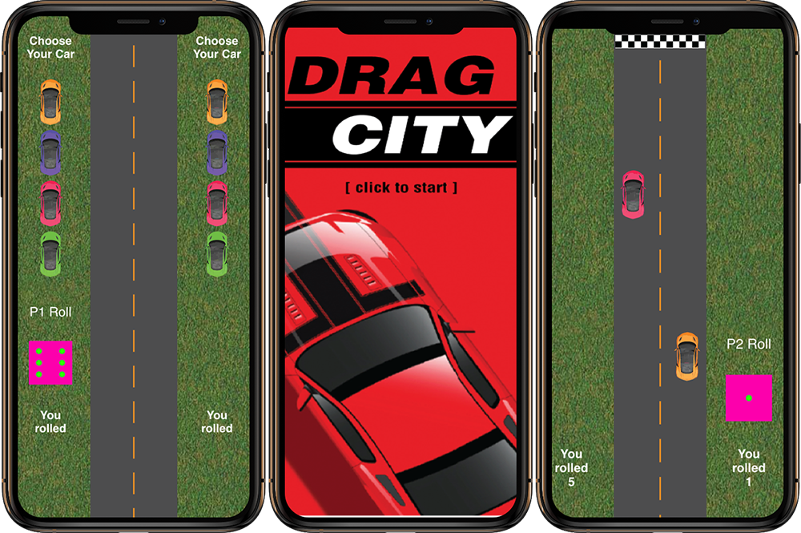

# DragCity

## Introduction

**DragCity** is a two player turn based racing game where players take turns rolling a dice where based on the number you role determines how far your car moves forward. The first car to the finish line wins!

## Screenshot

## Technologies

- [React](https://reactjs.org)
- [SCSS](https://sass-lang.com/)
- [Axios](https://github.com/axios/axios)
- [Node](https://nodejs.org/en/)
- [Express](https://expressjs.com/)

## Features

- Once past the landing page to get started, players must first choose which colour cars they want out of 4 options.
- Players take turns rolling the dice, when its first players turn, player 2's dice doesn't show and only player 1's dice shows. Then it switches once it's players 2's turn.
- The higher the number the dice lands on, the further your car moves up!
- Whoevers car passes the finish line first wins! And a notification pops up of which player won.

## Status

This app was built in two days as a pair programming challenge. It is only currently working for mobile resolution. We had a short timeline to finish the project but I felt really happy at the result of our app that we created. 

### Ideas for Future Enhancements:

- I wanted to make it responsive and expand it for tablet, laptop and desktop view.
- I wanted to change the dice and add features such as animations to the car movements.

## Inspiration

My inspiration for this app was that I always wanted to make some sort of game. My partner and I were brainstorming a bunch of ideas and this one seemed like the most fun and practically one. 

## Contact

Created by [Roy Lee](https://www.linkedin.com/in/roy-lee-jr/)